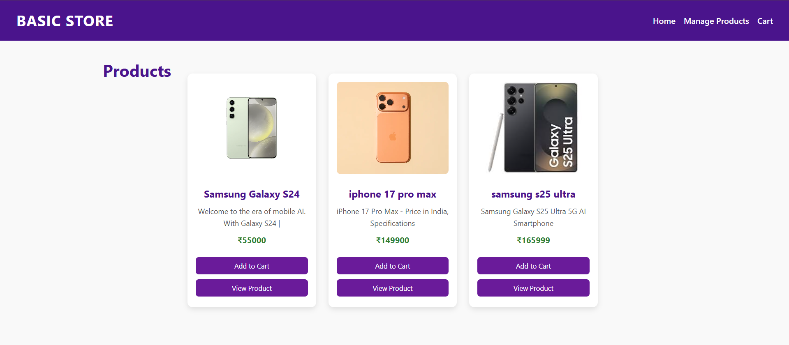
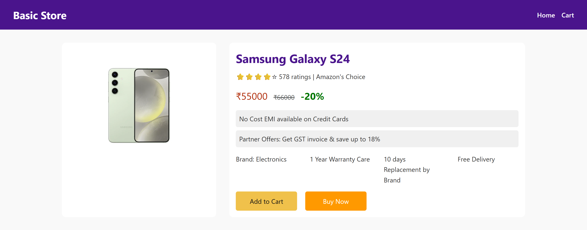
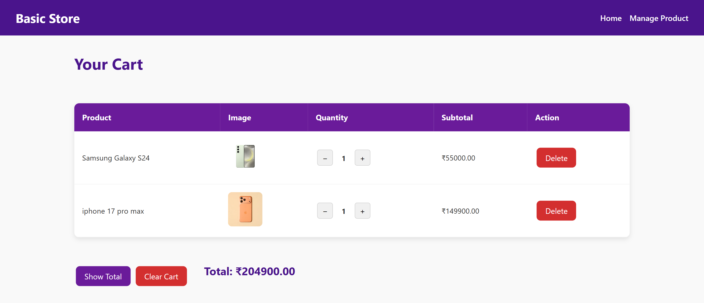
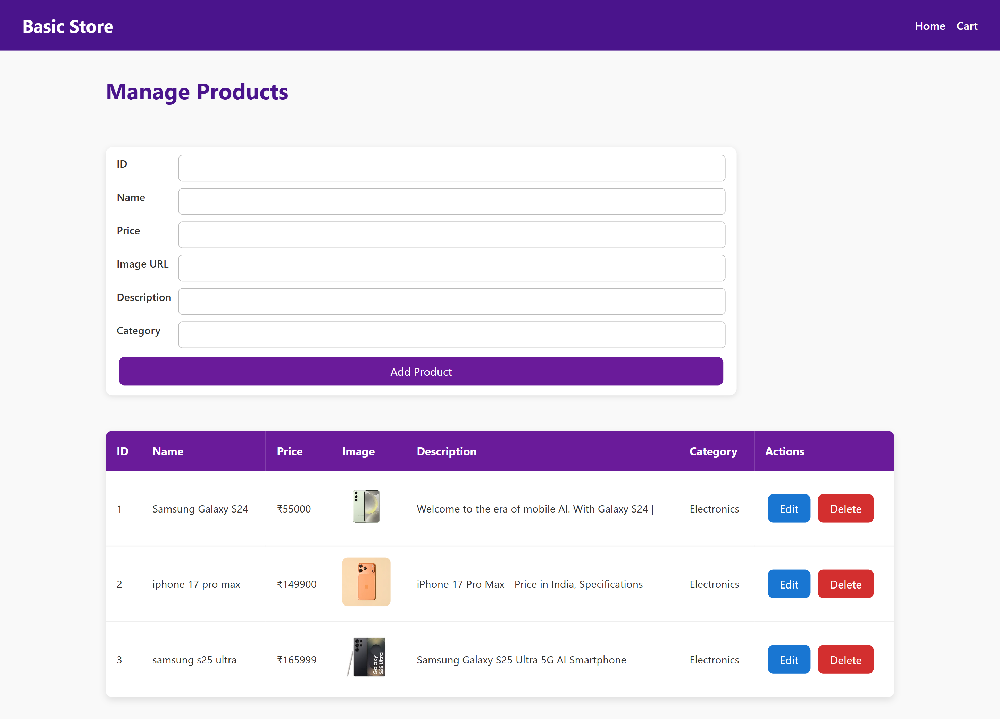
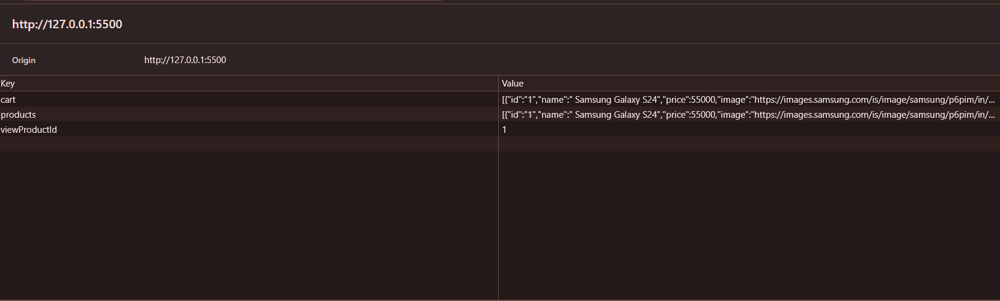

Basic Store 🛒

A fully responsive e-commerce web application built with HTML, CSS, and JavaScript. Users can manage products, view products on the home page, add products to the cart, and update cart quantities. Data is stored locally using LocalStorage, making it lightweight and easy to use.

🌟 Features

Product Management

Add, edit, and delete products.

Products saved in localStorage for persistence.

Home Page

Display products in a responsive grid layout.

Add to Cart button.

View Product button for detailed information.

View Product Page

Detailed product info including price, discount, ratings, and offers.

Add to Cart and Buy Now buttons.

Buy Now adds the product to the cart and redirects to the cart page.

Cart Page

View all added products.

Increase or decrease quantity using + / − buttons.

Delete products from cart.

View total price and clear cart option.

Responsive Design

Optimized for desktop, tablet, and mobile devices.

🗂️ Project Structure
Basic-Store/
│
├── Assesat/
│   ├── CSS/
│   │   └── style.css         # All styling for pages
│   └── JS/
│       └── script.js         # All JavaScript functionality
│
├── index.html                # Home page
├── viewproduct.html          # Detailed product page
├── cart.html                 # Cart page
└── productmanage.html        # Product management page

🚀 Getting Started

Clone the repository

git clone <repository_url>

Open index.html in your browser.

Manage products via productmanage.html:

Add product ID, Name, Price, Image URL, Description, and Category.

Browse products on the home page:

Click Add to Cart to add products.

Click View Product for details.

Cart management on cart.html:

Adjust quantities with + / − buttons.

Delete products or clear the cart.

Total price updates automatically.

📂 LocalStorage Keys

products → Stores all added products

cart → Stores cart items

viewProductId → Stores the product ID currently being viewed

## 🖼 Screenshots

**Home Page**  

**View Product Page**  

**Cart Page**  

**Product Management Page**  

**Local Storage**  

⚙️ Technologies Used

HTML5 – Structure of pages

CSS3 – Styling and responsive design

JavaScript (Vanilla JS) – Dynamic content and cart management

LocalStorage – Persistent storage for products and cart data

📌 Future Improvements

Add search and filter products.

Implement product categories for better navigation.

Add user authentication for multiple users.
